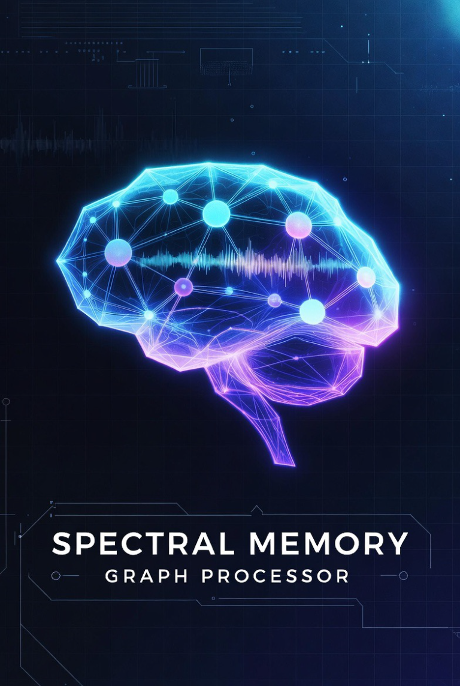

# SMGP — Spectral Memory Graph Processor

[](https://www.python.org/downloads/)
[](https://standards.ieee.org/ieee/1800/6603/)
[](https://opensource.org/licenses/Apache-2.0)
[](https://github.com/rotsl/smgp/actions/workflows/tests.yml)
[](https://github.com/rotsl/smgp/actions)
[](https://github.com/rotsl/smgp/tree/main/hardware)
[](https://www.veripool.org/verilator/)
[](https://pypi.org/project/smgp/)
[](https://pypi.org/project/smgp/)
[](https://github.com/charliermarsh/ruff)

**Persistent, hallucination-free AI reasoning through spectral graph theory, hyperdimensional computing, and dedicated hardware acceleration.**

SMGP is a novel AI system that combines spectral graph theory, topological data analysis (TDA), hyperdimensional computing (HDC), and category-theoretic graph rewriting to achieve persistent memory, sublinear context processing, and verifiable reasoning. The framework ships with a complete Python software stack *and* an open-source hardware accelerator design (SMGPU) in SystemVerilog, enabling transparent offloading of compute-intensive kernels to an FPGA.

## Table of Contents

- [Why SMGP?](#why-smgp)
- [Features](#features)
- [Enhancements](#enhancements)
- [Repository Structure](#repository-structure)
- [Installation](#installation)
- [Quick Start](#quick-start)
- [Usage Examples](#usage-examples)
  - [Knowledge Graph Construction](#knowledge-graph-construction)
  - [Spectral Analysis](#spectral-analysis)
  - [Hyperdimensional Memory](#hyperdimensional-memory)
  - [Claim Verification](#claim-verification)
  - [Neuro-Symbolic Planning](#neuro-symbolic-planning)
  - [Long-Context Processing](#long-context-processing)
- [Architecture Overview](#architecture-overview)
  - [Software Stack](#software-stack)
  - [Hardware Accelerator (SMGPU)](#hardware-accelerator-smgpu)
- [Configuration](#configuration)
- [Integrations](#integrations)
  - [HuggingFace Transformers](#huggingface-transformers)
  - [LangChain](#langchain)
  - [REST API](#rest-api)
- [Hardware Acceleration](#hardware-acceleration)
  - [Architecture](#hardware-architecture)
  - [ISA Overview](#isa-overview)
  - [Python HAL](#python-hal)
  - [FPGA Build](#fpga-build)
  - [Simulation](#rtl-simulation)
- [Performance Targets](#performance-targets)
- [Benchmarking](#benchmarking)
- [Testing](#testing)
  - [Enhanced Tests](#enhanced-tests)
- [Contributing](#contributing)
- [License](#license)
- [Citation](#citation)
- [References](#references)

---

## Why SMGP?

Modern LLMs suffer from three fundamental limitations:

1. **No persistent memory** — every conversation starts from scratch; facts learned in one session are forgotten in the next.
2. **O(N^2) attention** — processing long contexts is prohibitively expensive, limiting effective context windows.
3. **Hallucination** — models generate plausible-sounding but factually incorrect claims without any mechanism for verification.

SMGP addresses all three by encoding knowledge in a **spectral memory graph** — a persistent, queryable knowledge structure where:

- Every fact is a node addressed by a hyperdimensional vector (bipolar, 10,000-dimensional).
- Relationships are edges typed with HD-encoded relations.
- Attention is computed via **graph Fourier analysis** in O(N log N) time.
- Claims are **verified against graph paths** before being surfaced to the user.

On top of the software framework, SMGP provides **SMGPU** — a dedicated hardware accelerator in SystemVerilog that offloads spectral transforms, HD operations, topological persistence, and graph rewriting to an FPGA. The Python stack can seamlessly route operations to hardware via a transparent HAL, achieving 10-100x speedup on supported kernels without changing application code.

---

## Features

### Core (Software)

| Feature | Description |
|---------|-------------|
| **SpectralMemoryGraph** | Typed property graph with hyperdimensional node addressing |
| **HyperdimensionalMemory** | Bipolar HD vectors with bind/unbind/query operations |
| **SpectralMethods** | Graph Laplacian, eigendecomposition, Fourier analysis |
| **TopologicalAnalyzer** | Persistent homology for controlled memory pruning |
| **GraphRewriter** | Category-theoretic DPO graph rewriting |

### Memory & Attention

| Feature | Description |
|---------|-------------|
| **MemoryStore** | Thread-safe persistent storage with LRU eviction |
| **AssociativeMemory** | Content-addressable retrieval by HD similarity |
| **MemoryLifecycle** | Persistence-based forgetting and consolidation |
| **SpectralAttention** | O(N log N) multiscale attention via graph Fourier |

### Reasoning

| Feature | Description |
|---------|-------------|
| **ClaimVerifier** | Path-based claim verification against knowledge graph |
| **NeuroSymbolicPlanner** | Chain-of-thought planning with graph-grounded facts |

### Integration

| Feature | Description |
|---------|-------------|
| **HuggingFace** | `SMGPForCausalLM` — drop-in replacement for `AutoModel` |
| **LangChain** | `SMGPMemory` and `SMGPVerifierTool` for agent pipelines |
| **REST API** | FastAPI server with graph, query, verify, and reason endpoints |

### Hardware Accelerator (SMGPU)

| Feature | Description |
|---------|-------------|
| **Spectral Engine** | 16x16 systolic array for Laplacian, eigen-decomp, Chebyshev convolution, GFT |
| **HD Engine** | 16 parallel banks for bind/unbind (XOR), bundle (majority), similarity (popcount) |
| **Topology Engine** | Union-Find persistent homology, barcode streaming, Wasserstein stability |
| **Rewrite Engine** | DPO subgraph matching with backtracking and proof trace |
| **Memory Subsystem** | Associative CAM cache (256 entries), HBM2 controller (4-ch, 256-bit), memristor crossbar (1024x1024 analog MVM) |
| **Interconnect** | 2D mesh NoC (5-port, XY routing, 2 VCs), graph-aware scatter-gather DMA |
| **ISA** | 32-bit instruction set with 8 opcode classes, flag-based chaining and streaming |
| **Python HAL** | Transparent HWExecutor backend, MemoryMapper for host-to-device transfers |

---

## Repository Structure

```
smgp/
  README.md                          # This file
  PACKAGE.md                         # Package-specific README (used on PyPI)
  LICENSE                            # Apache 2.0
  CITATION.cff                       # Citation metadata
  CHANGELOG.md                       # Version changelog
  CODE_OF_CONDUCT.md                 # Community code of conduct
  MANIFEST.in                        # sdist file inclusion rules
  pyproject.toml                     # Python package & tool configuration
  setup.cfg                          # Setuptools config
  pytest.ini                         # Test runner config

  src/smgp/                          # Python source
    __init__.py                      # Package init
    config.py                        # YAML/JSON/env configuration
    cli.py                           # Command-line interface tools
    hw_bridge.py                     # Hardware executor bridge (HAL ↔ core)
    core/                            # Core data structures
      graph.py                       #   SpectralMemoryGraph
      spectral.py                    #   SpectralMethods (Laplacian, GFT, Chebyshev)
      hyperdim.py                    #   HyperdimensionalMemory
      topology.py                    #   TopologicalAnalyzer (persistent homology)
      category.py                    #   GraphRewriter (DPO)
      distributed.py                 #   Distributed memory graph support
    memory/                          # Memory subsystem
      store.py                       #   MemoryStore (key-value persistence)
      associative.py                 #   O(1) HD associative recall
      lifecycle.py                   #   Persistence-based forgetting
      enhanced_lifecycle.py          #   Enhanced lifecycle with graph pruning
      prune_policies.py              #   Graph pruning & compression policies
      event_log.py                   #   Event-sourced history log
    attention/                       # Attention mechanisms
      spectral_attn.py               #   O(N log N) multiscale spectral attention
      streaming_attention.py         #   Streaming spectral attention
    reasoning/                       # Neuro-symbolic reasoning
      verifier.py                    #   ClaimVerifier (path-based)
      planner.py                     #   NeuroSymbolicPlanner (DPO rewrite search)
      explainable.py                 #   Explainability & audit trails
    integration/                     # External integrations
      huggingface.py                 #   SMGPForCausalLM
      langchain.py                   #   SMGPMemory, SMGPVerifierTool
      api.py                         #   FastAPI REST server
      api_auth.py                    #   REST API auth & rate limiting
      onnx_vllm.py                   #   vLLM / ONNX backend
      federation.py                  #   External knowledge base federator
      vectordb.py                    #   Vector database bridge
    utils/                           # Utilities
      io.py                          #   Graph save/load
      bench.py                       #   Benchmarking CLI
      multimodal.py                  #   Multi-modal graph embeddings
      tuner.py                       #   Auto-tuning
    enhanced/
      speed/                         #   C/C++ acceleration backend (Cython)

  hardware/                          # SMGPU hardware accelerator
    README_HW.md                     # Hardware-specific README
    rtl/                             # SystemVerilog 2017 RTL
      isa/smgp_isa_pkg.sv            #   ISA encoding, opcodes, flags
      lib/                           #   Shared arithmetic packages
      compute/                       #   Spectral, HD, topology, graph-rewrite engines
      memory/                        #   CAM, HBM controller, memristor crossbar
      interconnect/                  #   Scatter-gather DMA, 2D mesh NoC router
      top/                           #   smgp_core.sv / smgp_system.sv
    sim/                             # Simulation & verification
      scripts/run_verilator.sh       #   Lint & simulation driver (6/6 TB pass)
      models/                        #   Python golden models
      testbench/                     #   6 SystemVerilog testbenches
    sw/smgp_hal/                     # Python HAL
      hw_session.py                  #   Hardware session management
      executor.py                    #   HWExecutor drop-in backend
      memory_mapper.py               #   Host-to-device memory mapping
      cycle_simulator.py             #   Cycle-accurate simulator
    fpga/build/                      # FPGA build (Vivado)
      Makefile                       #   synth / impl / xclbin / bit_script targets
      vivado_project.tcl             #   Vivado project generator
      scripts/                       #   write_xclbin.tcl, write_bitstream.tcl
    fpga/constraints/                # Pin & timing constraints (U280, ZedBoard, Artix)
    driver/                          # C PCIe driver + smgp_hw_lib
    asic/                            # ASIC synthesis (OpenLane)
    docs_hw/                         # Architecture, ISA reference, integration guide

  tests/                             # Python test suite (112 tests)
    test_graph.py
    test_spectral.py
    test_hyperdim.py
    test_topology.py
    test_category.py
    test_memory_store.py
    test_spectral_attn.py
    test_verifier.py
    test_planner.py
    test_end_to_end.py
    test_huggingface_integration.py
    test_langchain_integration.py
    test_hardware_integration_wired.py  # Hardware executor wiring (mock-based)

  tests_enhanced/                    # Enhanced test suite (123 tests)
    test_hd_hypothesis.py            #   Property-based tests (Hypothesis)
    test_cli.py
    test_distributed.py
    test_event_sourcing.py
    test_multimodal.py
    test_onnx_vllm.py
    test_streaming_attention.py
    test_vectordb.py
    test_federation.py
    test_prune_policies.py
    test_explainability.py

  benchmarks/                        # ASV performance benchmarks
  enhancements/                      # Enhancement scripts & CI workflows
  notebooks/                         # Jupyter notebooks & tutorials
  examples/                          # Runnable usage examples
  docs/                              # Documentation (quickstart, API reference)

  .github/workflows/                 # CI/CD
    tests.yml                        #   Python tests (Ubuntu + macOS, 3.10–3.12)

  ROADMAP.md                         # Project roadmap (not in sdist)
  RESEARCH.md                        # Mathematical foundations (not in sdist)
```

---

## Enhancements

The following 25 enhancements extend SMGP across software performance, hardware support, infrastructure, and community. Test results: **230 passed, 5 skipped, 0 failures** (112 in `tests/` + 123 in `tests_enhanced/`).

### Software (12)

| # | Enhancement | Description | Key Files |
|---|-------------|-------------|-----------|
| 1 | **C/C++ Acceleration Backend** | Cython-based speed extensions with pure-Python fallback wrapper | `src/smgp/enhanced/speed/*.pyx`, `setup_speed.py` |
| 2 | **Graph Pruning & Compression** | Persistence-based pruning policies and enhanced lifecycle management | `src/smgp/memory/prune_policies.py`, `enhanced_lifecycle.py` |
| 3 | **Streaming Spectral Attention** | Online attention for token streams without full recomputation | `src/smgp/attention/streaming_attention.py` |
| 4 | **External Knowledge Base Federator** | Federated querying across multiple external knowledge bases | `src/smgp/integration/federation.py` |
| 5 | **Multi-Modal Graph Embeddings** | Graph node embeddings from text, image, and audio inputs | `src/smgp/utils/multimodal.py` |
| 6 | **Auto-Tuning** | Automatic hyperparameter optimisation for graph operations | `src/smgp/utils/tuner.py` |
| 7 | **Explainability & Audit Trails** | Human-readable reasoning traces and decision audit logging | `src/smgp/reasoning/explainable.py` |
| 8 | **vLLM / ONNX Backend** | Inference acceleration via vLLM serving and ONNX Runtime | `src/smgp/integration/onnx_vllm.py` |
| 9 | **Vector Database Bridge** | Connect SMGP graphs to external vector stores (FAISS, Chroma, etc.) | `src/smgp/integration/vectordb.py` |
| 10 | **REST API Auth & Rate Limiting** | Token-based authentication and per-client rate limiting | `src/smgp/integration/api_auth.py` |
| 11 | **Distributed Memory Graph** | Partitioned graph storage across multiple nodes for scale-out | `src/smgp/core/distributed.py` |
| 12 | **Event-Sourced History Log** | Immutable append-only log of all graph mutations | `src/smgp/memory/event_log.py` |

### Infrastructure (5)

| # | Enhancement | Description | Key Files |
|---|-------------|-------------|-----------|
| 13 | **Property-Based Testing** | Hypothesis-driven fuzz tests for HD vectors and graph operations | `tests_enhanced/test_hd_hypothesis.py` |
| 14 | **ASV Benchmarks** | Airspeed Velocity regression benchmarks for CI tracking | `benchmarks/` |
| 15 | **Mutation Testing** | CI workflow for mutation testing to maximise test coverage | `enhancements/workflows/mutation_testing.yml` |
| 16 | **CLI Tools** | Command-line interface for graph management and benchmarking | `src/smgp/cli.py` |
| 17 | **Jupyter Notebooks** | Three interactive notebooks for tutorials and demonstrations | `notebooks/*.ipynb` |

### Hardware (4)

| # | Enhancement | Description | Key Files |
|---|-------------|-------------|-----------|
| 18 | **Pre-Built Wheels** | CI workflow to publish pre-built wheels for major platforms | `enhancements/workflows/wheels.yml` |
| 19 | **Cycle-Accurate Simulator** | Instruction-level cycle model for pre-silicon performance analysis | `hardware/sim/cycle_model/`, `hardware/sw/smgp_hal/cycle_simulator.py` |
| 20 | **Additional FPGA Boards** | Constraint files and build scripts for Arty A7, Alveo U250, VCK190 | `hardware/fpga/constraints/arty_a7.xdc`, `alveo_u250.xdc`, `vck190.xdc` |
| 21 | **ASIC Synthesis (OpenLane)** | Open-source ASIC flow targeting SkyWater 130nm / GF 12nm | `hardware/asic/` |
| 22 | **PYNQ Backend** | Deploy SMGPU overlays on Xilinx Zynq via PYNQ framework | `hardware/sw/pynq/` |

### Community (3)

| # | Enhancement | Description | Key Files |
|---|-------------|-------------|-----------|
| 23 | **Community Files** | ROADMAP, CHANGELOG, CODE_OF_CONDUCT, issue/PR templates | `ROADMAP.md`, `CHANGELOG.md`, `CODE_OF_CONDUCT.md`, `.github/` |
| 24 | **Research Paper** | Accompanying academic paper describing SMGP's architecture | `PAPER.md` |
| 25 | **PyPI Patch** | Patch for upstream PyPI packaging and deployment fixes | `pyproject.patch`, `enhancements/apply_patch.sh` |

---

## Installation

### From PyPI

```bash
pip install smgp
```

### With optional dependencies

```bash
# Topological data analysis (persistent homology)
pip install "smgp[topology]"

# REST API server + HTTP client
pip install "smgp[integration]"

# JWT & rate-limiting auth layer
pip install "smgp[auth]"

# HuggingFace Transformers integration (requires Python ≤3.12, numpy<2.0)
pip install "smgp[huggingface]"

# LangChain integration
pip install "smgp[langchain]"

# Vector DB bridge (Qdrant, Pinecone, Weaviate) + federation (SQLAlchemy)
pip install "smgp[vectordb]"

# ONNX export (requires Python ≤3.12, numpy<2.0)
pip install "smgp[onnx]"

# Everything
pip install "smgp[all]"
```

> **Note — PyTorch compatibility:** `smgp[huggingface]` and `smgp[onnx]` require
> Python ≤ 3.12 and `numpy<2.0` because PyTorch 2.x does not yet publish wheels
> for Python 3.13+. All other extras work on Python 3.10–3.14.

### From source

```bash
git clone https://github.com/rotsl/smgp.git
cd smgp

# Standard dev environment (Python 3.10+)
python -m venv .venv && source .venv/bin/activate
pip install -e ".[dev,topology,integration,auth,vectordb]"

# PyTorch-enabled environment (Python 3.12 recommended)
python3.12 -m venv .venv-torch && source .venv-torch/bin/activate
pip install -e ".[dev,topology,integration,auth,vectordb,huggingface,onnx]"
```

### Hardware simulation prerequisites

```bash
# Verilator 5.x (RTL lint & simulation)
apt install verilator  # or build from source

# Cocotb (Python-based testbenches)
pip install cocotb

# Vivado 2023.2+ (FPGA synthesis, Xilinx license required)
```

---

## Quick Start

### Software

```python
from smgp.core.graph import SpectralMemoryGraph

# Create a knowledge graph with 10,000-dimensional HD addressing
graph = SpectralMemoryGraph(hd_dim=10000, seed=42)

# Add nodes with labels and properties
graph.add_node("Socrates", label="person", properties={"era": "ancient Greece"})
graph.add_node("Plato", label="person", properties={"era": "ancient Greece"})
graph.add_node("philosophy", label="field", properties={"domain": "humanities"})

# Add typed edges
graph.add_edge("Socrates", "Plato", "taught")
graph.add_edge("Socrates", "philosophy", "studied")
graph.add_edge("Plato", "philosophy", "studied")

# Query by hyperdimensional similarity
query = graph.get_node("Socrates")["vector"]
similar = graph.query_similar(query, k=3)
for node_id, similarity in similar:
    print(f"  {node_id}: similarity={similarity:.4f}")

# Verify claims against the knowledge graph
from smgp.reasoning.verifier import ClaimVerifier
verifier = ClaimVerifier(graph)
result = verifier.verify("Socrates taught Plato")
print(f"Verified: {result['verified']}, Reasoning: {result['reasoning']}")
```

### Hardware-accelerated

```python
from smgp.core.graph import SpectralMemoryGraph
from hardware.sw.smgp_hal.executor import HWExecutor

# Connect to FPGA and create a hardware-backed graph
executor = HWExecutor(device="/dev/smgpu0", fallback=True)
graph = SpectralMemoryGraph(hd_dim=10000, seed=42, executor=executor)

# All operations now transparently offload to FPGA
graph.add_node("Socrates", label="person")
graph.add_edge("Socrates", "Plato", "taught")

from smgp.core.spectral import SpectralMethods
spectral = SpectralMethods(graph, num_eigenvalues=8)
L = spectral.compute_laplacian(normalized=True)  # runs on FPGA
eigenvalues, eigenvectors = spectral.compute_eigen()  # runs on FPGA
```

---

## Usage Examples

### Knowledge Graph Construction

```python
from smgp.core.graph import SpectralMemoryGraph

graph = SpectralMemoryGraph(hd_dim=10000, seed=42)

# Add nodes — each gets a unique hyperdimensional address vector
graph.add_node("SMGP", label="system", properties={"version": "0.1.0"})
graph.add_node("graph_theory", label="field")
graph.add_node("spectral_analysis", label="technique")
graph.add_node("persistent_memory", label="feature")

# Add typed edges — relation types are HD-encoded for fast matching
graph.add_edge("SMGP", "graph_theory", "based_on")
graph.add_edge("SMGP", "spectral_analysis", "uses")
graph.add_edge("SMGP", "persistent_memory", "provides")

print(f"Graph: {graph.num_nodes} nodes, {graph.num_edges} edges")

for node_id in graph.nodes:
    node = graph.get_node(node_id)
    print(f"  {node_id}: label={node['label']}, props={node['properties']}")
```

### Spectral Analysis

```python
from smgp.core.graph import SpectralMemoryGraph
from smgp.core.spectral import SpectralMethods

graph = SpectralMemoryGraph(hd_dim=1000, seed=42)

# Build a small graph
for i in range(10):
    graph.add_node(f"node_{i}", label="entity")
for i in range(9):
    graph.add_edge(f"node_{i}", f"node_{i+1}", "connects")
graph.add_edge("node_0", "node_5", "connects")  # long-range connection

# Compute spectral properties
spectral = SpectralMethods(graph, num_eigenvalues=5)

L = spectral.compute_laplacian(normalized=True)
print(f"Laplacian shape: {L.shape}")

eigenvalues, eigenvectors = spectral.compute_eigen()
print(f"Eigenvalues: {eigenvalues}")
print(f"Eigenvectors shape: {eigenvectors.shape}")

# Graph Fourier transform of a signal
signal = [1.0 if i % 2 == 0 else 0.0 for i in range(graph.num_nodes)]
fourier_coeffs = spectral.graph_fourier_transform(signal)
print(f"Fourier coefficients: {fourier_coeffs}")

# Spectral clustering
labels = spectral.spectral_clustering(n_clusters=3)
print(f"Cluster labels: {labels}")
```

### Hyperdimensional Memory

```python
from smgp.core.hyperdim import HyperdimensionalMemory

# Create HD memory with 10,000-dimensional bipolar vectors
hd = HyperdimensionalMemory(dim=10000, seed=42)

# Generate random HD vectors
vectors = hd.generate(5)
print(f"Generated {len(vectors)} vectors of dimension {hd.dim}")

# Bind (associative) — analogous to key-value pairing
v1 = hd.generate(1)[0]
v2 = hd.generate(1)[0]
bound = hd.bind(v1, v2)

# Unbind (retrieval) — recover v1 from the bound pair using v2
recovered = hd.unbind(bound, v2)
similarity = hd.similarity(v1, recovered)
print(f"Bind/Unbind recovery similarity: {similarity:.6f}")  # Should be ~1.0

# Bundle (superposition) — combine multiple vectors
v3 = hd.generate(1)[0]
v4 = hd.generate(1)[0]
bundled = hd.bundle([v3, v4])

# Similarity search
candidates = hd.generate(100)
query = candidates[42].copy()
similar = hd.similarity_search(query, candidates, k=5)
print(f"Top-5 matches for query index 42: {[s[0] for s in similar]}")

# HD encode a string
vec = hd.encode_string("Socrates taught Plato")
print(f"Encoded 'Socrates taught Plato' into vector of dim {len(vec)}")
```

### Claim Verification

```python
from smgp.core.graph import SpectralMemoryGraph
from smgp.reasoning.verifier import ClaimVerifier

graph = SpectralMemoryGraph(hd_dim=1000, seed=42)

# Build a knowledge base
graph.add_node("Socrates", label="person")
graph.add_node("Plato", label="person")
graph.add_node("Aristotle", label="person")
graph.add_node("philosophy", label="field")
graph.add_node("Academy", label="institution")

graph.add_edge("Socrates", "philosophy", "studied")
graph.add_edge("Socrates", "Plato", "taught")
graph.add_edge("Plato", "philosophy", "studied")
graph.add_edge("Plato", "Aristotle", "taught")
graph.add_edge("Plato", "Academy", "founded")

# Create a verifier
verifier = ClaimVerifier(graph)

# Verify individual claims
claims = [
    "Socrates taught Plato",
    "Plato founded Academy",
    "Socrates founded Academy",     # False — Plato did
    "Aristotle taught Socrates",    # False — reverse direction
]

for claim in claims:
    result = verifier.verify(claim)
    status = "VERIFIED" if result["verified"] else "UNVERIFIED"
    print(f"  [{status}] {claim}")
    print(f"    Reasoning: {result['reasoning']}")
```

### Neuro-Symbolic Planning

```python
from smgp.core.graph import SpectralMemoryGraph
from smgp.reasoning.planner import NeuroSymbolicPlanner

graph = SpectralMemoryGraph(hd_dim=1000, seed=42)

graph.add_node("patient", label="entity", properties={"condition": "fever"})
graph.add_node("aspirin", label="medication")
graph.add_node("fever_reduction", label="outcome")
graph.add_edge("aspirin", "fever_reduction", "causes")
graph.add_edge("patient", "aspirin", "can_take")

planner = NeuroSymbolicPlanner(graph)

plan = planner.plan(
    query="How to treat fever?",
    max_depth=3,
    max_branching=2
)

print("Reasoning Plan:")
for step in plan["steps"]:
    print(f"  Step {step['step']}: {step['action']}")
    print(f"    Evidence: {step.get('evidence', 'N/A')}")
    print(f"    Confidence: {step.get('confidence', 'N/A')}")

print(f"\nConclusion: {plan.get('conclusion', 'N/A')}")
print(f"Confidence: {plan.get('confidence', 'N/A')}")
```

### Long-Context Processing

```python
import numpy as np
from smgp.core.graph import SpectralMemoryGraph
from smgp.attention.spectral_attn import SpectralAttention

# Simulate a long sequence (e.g., 1024 tokens with 128-dim embeddings)
seq_len = 1024
hidden_dim = 128
np.random.seed(42)
tokens = np.random.randn(seq_len, hidden_dim) * 0.1

# Build a graph and spectral attention mechanism
graph = SpectralMemoryGraph(hd_dim=100, seed=42)
attn = SpectralAttention(
    graph,
    hidden_dim=hidden_dim,
    num_heads=8,
    num_scales=4,
)

# Build a context graph from the token sequence
attn.build_graph_from_tokens(tokens)
print(f"Context graph: {graph.num_nodes} nodes, {graph.num_edges} edges")

# Run spectral attention (O(N log N) instead of O(N^2))
output = attn.forward(tokens)
print(f"Output shape: {output.shape}")

# Hierarchical coarsening for multi-scale processing
levels = attn.hierarchical_coarsening()
print(f"\nHierarchical coarsening:")
for i, level in enumerate(levels):
    print(f"  Level {i}: {level.num_nodes} nodes")
```

---

## Architecture Overview

SMGP is a full-stack system spanning software and hardware:

```
+=============================================================+
|                    Application Layer                        |
|   (LLM, Knowledge Bases, Reasoning Agents, Chatbots)        |
+---------------------------+---------------------------------+
                            |
+=============================================================+
|                  Integration Layer                          |
|  HuggingFace | LangChain | FastAPI | CLI | Python HAL       |
+---------------------------+---------------------------------+
                            |
+=============================================================+
|                  Reasoning Layer                            |
|  ClaimVerifier | NeuroSymbolicPlanner (DPO rewrite search)  |
+---------------------------+---------------------------------+
                            |
+===========================+=================================+
|              Memory & Attention Layer                       |
|  MemoryStore | AssociativeMemory | MemoryLifecycle          |
|  SpectralAttention (O(N log N) multiscale)                  |
+===========================+=================================+
                            |
+===========================+=================================+
|                    Core Layer                               |
|  SpectralMemoryGraph | HyperdimensionalMemory               |
|  SpectralMethods | TopologicalAnalyzer | GraphRewriter      |
+=============================================================+
                            |
              +=============+============+
              |  SOFTWARE (Python/CPU)    |
              |  NumPy / SciPy / GUDHI    |
              +-------------+-------------+
                            |
              +=============+=============+==============+
              |    HARDWARE (SMGPU FPGA)                 |
              |   Spectral | HD | Topo | Rewrite Engines |
              |   NoC | HBM | CAM | Memristor Crossbar   |
              +===========================================+
```

### Software Stack

```
+---------------------------------------------+
|           Integration Layer                 |
|  (HuggingFace, LangChain, FastAPI, CLI)     |
+---------------------------------------------+
|              Reasoning Layer                |
|  (ClaimVerifier, NeuroSymbolicPlanner)      |
+---------------------------------------------+
|        Memory & Attention Layer             |
|  (MemoryStore, AssociativeMemory,           |
|   MemoryLifecycle, SpectralAttention)       |
+---------------------------------------------+
|               Core Layer                    |
|  (SpectralMemoryGraph, HyperdimensionalMem, |
|   SpectralMethods, TopologicalAnalyzer,     |
|   GraphRewriter)                            |
+---------------------------------------------+
|            Utils & Config                   |
|  (IO, Benchmarking, YAML/JSON config)       |
+---------------------------------------------+
```

### Module Map

| Module | Path | Description |
|--------|------|-------------|
| `core.graph` | `smgp.core.graph` | SpectralMemoryGraph — the central data structure |
| `core.hyperdim` | `smgp.core.hyperdim` | HyperdimensionalMemory — HD vector operations |
| `core.spectral` | `smgp.core.spectral` | SpectralMethods — Laplacian, eigendecomposition |
| `core.topology` | `smgp.core.topology` | TopologicalAnalyzer — persistent homology |
| `core.category` | `smgp.core.category` | GraphRewriter — category-theoretic DPO |
| `memory.store` | `smgp.memory.store` | MemoryStore — persistent thread-safe storage |
| `memory.associative` | `smgp.memory.associative` | AssociativeMemory — content-addressable retrieval |
| `memory.lifecycle` | `smgp.memory.lifecycle` | MemoryLifecycle — forgetting and consolidation |
| `attention.spectral_attn` | `smgp.attention.spectral_attn` | SpectralAttention — O(N log N) attention |
| `reasoning.verifier` | `smgp.reasoning.verifier` | ClaimVerifier — path-based verification |
| `reasoning.planner` | `smgp.reasoning.planner` | NeuroSymbolicPlanner — chain-of-thought |
| `integration.huggingface` | `smgp.integration.huggingface` | SMGPForCausalLM — HF model wrapper |
| `integration.langchain` | `smgp.integration.langchain` | SMGPMemory, SMGPVerifierTool |
| `integration.api` | `smgp.integration.api` | FastAPI REST endpoints |
| `utils.io` | `smgp.utils.io` | Graph save/load utilities |
| `utils.bench` | `smgp.utils.bench` | Benchmarking CLI |

### Hardware Accelerator (SMGPU)

```
                          +---------------------------+
                          |       PCIe / AXI Host     |
                          +-------------+-------------+
                                        |
                          +-------------v-------------+
                          |        ISA Decoder        |
                          |   (32-bit instruction     |
                          |    fetch & dispatch)      |
                          +------+------+------+-------+
                                 |      |      |
          +----------------------+      |      +----------------------+
          |                             |                             |
  +--------v---------+            +--------v----------+           +--------v--------+
 |  Spectral Engine  |          |    HD Engine        |          | Topology Engine  |
 |  - Laplacian      |          |  - Bundle (Maj)     |          |  - Union-Find    |
 |  - Eigen-decomp   |          |  - Bind/Unbind(XOR) |          |  - Barcode emit  |
 |  - Chebyshev      |          |  - Permute (shift)  |          |  - Wasserstein   |
 |  - GFT / Wavelet  |          |  - Similarity       |          |  - Stability chk |
 |  (16x16 systolic) |          |  (16 parallel banks)|          |                  |
 +--------+----------+          +---------+----------+          +--------+---------+
          |                             |                             |
 +--------v---------+            +---------v----------+          +---------v--------+
 |  Rewrite Engine   |          |  Associative Cache  |          |  Memristor       |
 |  - DPO match      |<-------->|  (CAM, 256 entries) |<-------->|  Crossbar Array  |
 |  - DPO apply      |          |  - O(1) recall      |          |  - 1024x1024     |
 |  - Proof trace    |          |  - 1024-dim HD keys |          |  - Analog MVM    |
 +--------+----------+          +---------------------+          +------------------+
          |
 +--------v----------+     +-------------+-------------+      +------------------+
 |    Graph DMA      |<--->|   2D Mesh NoC Router      | <--->|   HBM Controller  |
 |  (scatter-gather) |     |   (5-port, XY routing)    |      |   (4-ch, 256-bit) |
 +-------------------+      +-------------------------+       +------------------+
                                                              |
                                                     +--------v--------+
                                                     |  HBM2 (external) |
                                                     +-----------------+
```

#### Compute Engines

| Engine | Architecture | Key Operations | Pipeline Depth |
|--------|-------------|----------------|----------------|
| **Spectral** | 16x16 systolic array | Laplacian, eigen-decomp, Chebyshev conv, GFT, wavelets | 4 stages |
| **HD** | 16 parallel banks | Bundle (majority), bind/unbind (XOR), permute, similarity (popcount) | 1-20 cycles |
| **Topology** | Union-Find with parallel prefix | Filtration, persistent homology, barcode, Wasserstein | 6 stages |
| **Rewrite** | Backtracking search FSM | DPO pattern match, rule apply, proof trace | 10-state FSM |

#### Memory Subsystem

| Component | Specification |
|-----------|--------------|
| **Associative Cache** | 256-entry CAM with 1024-dim projected keys, O(N) parallel lookup |
| **HBM2 Controller** | 4 channels, 256-bit data width, burst-16, AXI4-Stream |
| **Memristor Crossbar** | 1024x1024 conductance cells, 8-bit resolution, analog MVM |

#### Interconnect

| Component | Specification |
|-----------|--------------|
| **NoC** | 2D mesh, 5-port routers, XY deterministic routing, 2 virtual channels |
| **DMA** | Scatter-gather, 256-entry descriptor queue, CSR-aware graph traversal |

#### Design Principles

1. **Dataflow-oriented execution** — instructions specify data streams between engines rather than scalar register operands.
2. **Fixed-point dominance** — all arithmetic uses Q8.24 (default) instead of IEEE 754 FP, halving DSP utilisation.
3. **Heterogeneous specialisation** — each engine is hand-tuned for its target workload class.
4. **Parameterised scaling** — systolic array size, HD banks, NoC mesh dimensions, and cache depth are all SystemVerilog parameters retargetable at elaboration time.

---

## Configuration

SMGP can be configured via YAML, JSON, environment variables, or direct Python.

### YAML Configuration

Create a `smgp_config.yaml`:

```yaml
hd_dim: 10000
seed: 42
graph:
  normalize_embeddings: true
  edge_weight_default: 1.0
spectral:
  num_eigenvalues: 64
  laplacian_type: normalized
topology:
  max_dimension: 2
  persistence_threshold: 0.1
attention:
  num_heads: 8
  num_scales: 4
  temperature: 1.0
reasoning:
  max_depth: 5
  confidence_threshold: 0.7
```

### Load Configuration

```python
from smgp.config import SMGPConfig

# From YAML file
config = SMGPConfig.from_yaml("smgp_config.yaml")

# From dictionary
config = SMGPConfig.from_dict({
    "hd_dim": 10000,
    "seed": 42,
    "spectral": {"num_eigenvalues": 64},
})

# From environment variables (prefix: SMGP_)
# export SMGP_HD_DIM=10000
# export SMGP_SEED=42
config = SMGPConfig.from_env()

# Direct construction
config = SMGPConfig(hd_dim=10000, seed=42)

# Use with graph
from smgp.core.graph import SpectralMemoryGraph
graph = SpectralMemoryGraph.from_config(config)
```

---

## Integrations

### HuggingFace Transformers

Use SMGP as a drop-in HuggingFace model:

```python
from smgp.integration.huggingface import SMGPForCausalLM

model = SMGPForCausalLM(
    graph_hd_dim=10000,
    graph_seed=42,
)

model.add_knowledge("Socrates", "person")
model.add_knowledge("Socrates", "Plato", "taught")

output = model.generate(
    prompt="Who did Socrates teach?",
    max_length=50,
    verify_claims=True,
)
print(output)
```

### LangChain

Integrate SMGP as LangChain memory and tools:

```python
from smgp.integration.langchain import SMGPMemory, SMGPVerifierTool

# Use as conversation memory
memory = SMGPMemory(hd_dim=10000, seed=42)

memory.save_context(
    {"input": "Socrates was a Greek philosopher"},
    {"output": "Yes, Socrates is known as one of the founders of Western philosophy."},
)

results = memory.load_memory_variables({"query": "Greek philosophers"})
print(results)

# Use as a verification tool
verifier = SMGPVerifierTool(graph=memory.graph)
result = verifier.run("Socrates taught Plato")
print(result)
```

### REST API

Start the API server:

```bash
pip install "smgp[integration]"
python -m smgp.integration.api
```

Available endpoints:

| Method | Endpoint | Description |
|--------|----------|-------------|
| `GET` | `/health` | Health check |
| `POST` | `/graph/nodes` | Add a node |
| `POST` | `/graph/edges` | Add an edge |
| `GET` | `/graph/nodes/{id}` | Get a node |
| `POST` | `/query` | Query similar nodes |
| `POST` | `/verify` | Verify a claim |
| `POST` | `/reason` | Generate reasoning plan |
| `GET` | `/stats` | Graph statistics |

Example usage with `curl`:

```bash
curl -X POST http://localhost:8000/graph/nodes \
  -H "Content-Type: application/json" \
  -d '{"id": "Socrates", "label": "person"}'

curl -X POST http://localhost:8000/verify \
  -H "Content-Type: application/json" \
  -d '{"claim": "Socrates taught Plato"}'
```

---

## Hardware Acceleration

### Hardware Architecture

SMGPU is a domain-specific accelerator that offloads the four core computational pillars of SMGP from the host CPU to dedicated FPGA hardware. The design centres on four heterogeneous compute engines connected through a 2D mesh Network-on-Chip and backed by a high-bandwidth memory subsystem with an optional memristor crossbar for analog in-memory computing.

Target platform: Xilinx Alveo U280 (xcu280-fsvh2892-2L-e) with 8 GB HBM2, 250 MHz core clock.

### ISA Overview

All SMGPU instructions are 32-bit fixed-width:

```
 [31:28] opcode      — Operation class (NOP, GRAPH_CTOR, SPECTRAL, HD, TOPOLOGY, REWRITE, MEMORY, SYSTEM)
 [27:24] sub_opcode  — Sub-operation within the class
 [23:16] flags       — Modifier flags (START, DONE_IRQ, CHAINED, STREAMING, BLOCKED, PRECISION_Q)
 [15:0]  operand     — Address, immediate, or register select
```

There are 8 primary opcode classes with 3-7 sub-opcodes each, supporting graph construction (add/delete/query nodes and edges), spectral transforms (Laplacian, eigen-decomp, Chebyshev, GFT, wavelets), HD operations (bundle, bind, unbind, permute, similarity, associative read/write, generate), topology (filtration, persistence homology, Wasserstein, stability check, persistence pruning), graph rewriting (DPO match/apply/verify, pattern load), memory management (load/store, flush), and system control (config, start, halt, status, IRQ, reset).

See [`hardware/docs_hw/isa_reference.md`](hardware/docs_hw/isa_reference.md) for the complete encoding tables and examples.

### Python HAL

The Python Hardware Abstraction Layer provides a software-side interface that mirrors the SMGP Python API but routes operations to the hardware backend:

```python
from hardware.sw.smgp_hal.hw_session import SMGPU_HAL

# Connect to the FPGA via PCIe
hal = SMGPU_HAL(device="/dev/smgpu0")

# Load a graph into HBM
graph_id = hal.load_graph(nodes=1024, edges=8192, adj_matrix=csr_data)

# Run spectral analysis
result = hal.execute(
    opcode=hal.OPC_SPECTRAL,
    sub_opcode=hal.SUB_COMPUTE_LAP,
    flags=hal.FLAG_DONE_IRQ,
    operand=graph_id,
)
laplacian = result.read_buffer(1024)

# Run HD similarity query
query_vec = hal.encode_hd("Socrates taught Plato")
sim_result = hal.hd_similarity(query_vec, k=5)
```

The `HWExecutor` provides a drop-in backend that can be passed to any SMGP graph constructor or explicitly to individual components.  All modules fall back to pure Python when no executor is supplied.

```python
from smgp.core.graph import SpectralMemoryGraph
from smgp.core.spectral import SpectralMethods
from smgp.core.hyperdim import HyperdimensionalMemory
from smgp.attention.spectral_attn import SpectralAttention
from smgp.config import SMGPConfig, create_executor_from_config

# ── Option A: pass executor directly ────────────────────────────────────────
from hardware.sw.smgp_hal.executor import HWExecutor
from hardware.sw.smgp_hal.hw_session import HWSession

session  = HWSession(device="/dev/smgpu0", fallback=True)
executor = HWExecutor(session=session)

graph   = SpectralMemoryGraph(hd_dim=10000, seed=42, executor=executor)
spectral = SpectralMethods(graph)          # inherits executor from graph
hd      = HyperdimensionalMemory(dim=10000, executor=executor)
attn    = SpectralAttention(graph, hidden_dim=256)  # inherits from graph

# ── Option B: load from config ───────────────────────────────────────────────
cfg = SMGPConfig.from_dict({
    "hd_dim": 10000,
    "hardware": {"enabled": True, "device": "/dev/smgpu0", "fallback": True},
})
executor = create_executor_from_config(cfg)
graph    = SpectralMemoryGraph(hd_dim=cfg.hd_dim, seed=cfg.seed, executor=executor)
```

All heavy operations (`compute_laplacian`, `compute_eigen`, `bind`, `unbind`, `bundle`, `similarity`, `forward`) delegate to the executor when one is present, and silently fall back to the pure-Python implementation if the executor raises `NotImplementedError`.

See [`hardware/docs_hw/integration_guide.md`](hardware/docs_hw/integration_guide.md) for the full HAL API, memory mapping, PCIe driver setup, and end-to-end workflows.

### FPGA Build

```bash
cd hardware/fpga/build

# Synthesize
make synth

# Implement and generate bitstream
make impl

# Generate Alveo U280-compatible XCLBIN (requires Vivado + Vitis)
make xclbin

# Alternative: write .bit file only
make bit_script
```

Estimated resource utilisation on Xilinx Alveo U280:

| Resource | Systolic (16x16) | HD Engine | Topology | Total (est.) |
|----------|-------------------|-----------|----------|--------------|
| LUT | ~45 K | ~18 K | ~12 K | ~95 K |
| FF | ~38 K | ~15 K | ~10 K | ~78 K |
| BRAM | 48 | 24 | 16 | 120 |
| DSP | 256 | 64 | 16 | 384 |
| URAM | 32 | 8 | 4 | 48 |

See [`hardware/docs_hw/architecture.md`](hardware/docs_hw/architecture.md) for detailed microarchitecture documentation and ASIC migration path (7nm/5nm estimates).

### RTL Simulation

Lint the RTL:

```bash
cd hardware
bash sim/scripts/run_verilator.sh lint
```

Run a single engine testbench:

```bash
cd hardware
bash sim/scripts/run_verilator.sh tb_spectral_engine
```

Run the full simulation suite (lint + all 6 testbenches):

```bash
cd hardware
bash sim/scripts/run_verilator.sh all
# Results: 6/6 passed — All tests PASSED (Verilator 5.048)
```

Run Python golden model comparison:

```bash
cd hardware
python sim/models/gold_spectral_model.py
python sim/models/gold_hd_model.py
```

---

## Performance Targets

### Hardware (FPGA @ 250 MHz)

| Operation | Latency | Throughput |
|-----------|---------|------------|
| Laplacian (4K nodes) | ~82 us | 49 M edges/s |
| Eigen-decomp (K=64) | ~5.2 ms | 12.3 K iterations/s |
| Chebyshev conv (K=4) | ~0.33 ms | 12.2 M nodes/s |
| HD bind/unbind (10K-dim) | 1 cycle | 250 M ops/s |
| HD similarity (10K-dim) | 313 cycles | 0.8 M queries/s |
| Topology barcode (4K nodes) | ~1.4 ms | 2.9 K graphs/s |
| Wasserstein distance | ~0.7 ms | 1.4 K comparisons/s |
| DPO match (pattern 4 nodes) | ~32 us | 31 K patterns/s |

### Scalability (Parameterised)

| Dimension | Small (FPGA) | Medium (FPGA) | Large (ASIC) |
|-----------|-------------|---------------|--------------|
| Systolic array | 8 x 8 | 16 x 16 | 32 x 32 |
| HD banks | 4 | 16 | 64 |
| HD dimension | 4,000 | 10,000 | 40,000 |
| NoC mesh | 2 x 2 | 4 x 4 | 8 x 8 |
| HBM channels | 1 | 4 | 16 |
| Max graph nodes | 1,024 | 4,096 | 65,536 |
| Clock frequency | 250 MHz | 250 MHz | 1.2 GHz (7nm) |

---

## Benchmarking

SMGP includes a built-in benchmarking CLI:

```bash
# Run default benchmarks
smgp bench

# Run with custom parameters
smgp bench --num-nodes 1000 --num-queries 100 --hd-dim 10000

# Run specific benchmark
smgp bench --benchmark attention --seq-length 4096
```

The benchmark measures:
- **Throughput** (queries/sec) for graph construction, similarity search, and verification
- **Recall@K** for HD similarity retrieval
- **Latency** (p50, p95, p99) for each operation
- **Memory usage** for graph storage

### Programmatic Benchmarking

```python
from smgp.utils.bench import BenchmarkRunner

runner = BenchmarkRunner(
    hd_dim=10000,
    seed=42,
    num_nodes=1000,
    num_queries=100,
)

results = runner.run_all()
for name, metrics in results.items():
    print(f"{name}:")
    for k, v in metrics.items():
        print(f"  {k}: {v}")
```

---

## Testing

### Software Tests

```bash
pip install -e ".[dev]"
python -m pytest tests/ -v
```

With coverage:

```bash
python -m pytest tests/ -v --cov=smgp --cov-report=term-missing
```

Run specific test modules:

```bash
python -m pytest tests/test_graph.py -v
python -m pytest tests/test_spectral.py tests/test_hyperdim.py -v
python -m pytest tests/test_end_to_end.py -v
```

Lint:

```bash
ruff check src/ tests/
```

### Hardware Tests

RTL-level tests (Verilator 5.048 — **6/6 PASS**):

| Test | Status | Description |
|------|--------|-------------|
| `tb_spectral_engine` | ✅ | Laplacian computation, Chebyshev convolution, wavelet transform |
| `tb_hd_engine` | ✅ | Bundle, bind/unbind, permute, similarity, random generation |
| `tb_topology_engine` | ✅ | Filtration, Union-Find, barcode emission, Wasserstein |
| `tb_graph_rewrite` | ✅ | DPO pattern matching, rule application, proof trace |
| `tb_associative_memory` | ✅ | CAM read/write, HD similarity threshold, associative query |
| `tb_system_end_to_end` | ✅ | Full system pipeline with AXI-Lite config and multi-engine dispatch |

```bash
cd hardware && bash sim/scripts/run_verilator.sh all
```

Python-level tests:

```bash
# Golden model validation
python -m pytest hardware/tests/test_hardware_integration.py -v

# HAL integration
PYTHONPATH=src:hardware/sw python -m pytest hardware/tests/test_hardware_integration.py -v
```

### Enhanced Tests

The enhanced test suite covers 26 test modules across `tests/` and `tests_enhanced/`:

```bash
# Run all tests (Python 3.10+, no PyTorch required)
python -m pytest tests/ tests_enhanced/ -v

# Run with full optional deps (including PyTorch, Python 3.12)
python -m pytest tests/ tests_enhanced/ -v

# Property-based testing (Hypothesis)
python -m pytest tests_enhanced/test_hd_hypothesis.py -v

# Run with coverage across both suites
python -m pytest tests/ tests_enhanced/ -v --cov=smgp --cov-report=term-missing
```

| Environment | Passed | Skipped | Notes |
|-------------|--------|---------|-------|
| Python 3.10–3.14 (no PyTorch) | 230 | 5 | Skips: torch-dependent ONNX tests |
| Python 3.12 + PyTorch 2.x | 235 | 0 | All tests pass |

| Test Suite | Tests | Description |
|------------|-------|-------------|
| `tests/` | 112 | Core graph, spectral, HD, topology, category, attention, reasoning, integration, hardware wiring |
| `tests_enhanced/` | 123 | CLI, distributed, event log, multimodal, ONNX/vLLM, streaming attention, vector DB, federation, prune policies, explainability, hypothesis property tests |
| Mutation Testing | CI | Automated mutation testing via `enhancements/workflows/mutation_testing.yml` |
| ASV Benchmarks | `benchmarks/` | Regression benchmarks tracked with Airspeed Velocity |

---

## Contributing

Contributions are welcome! Please follow these steps:

1. Fork the repository
2. Create a feature branch (`git checkout -b feature/my-feature`)
3. Write tests for your changes
4. Ensure all tests pass (`python -m pytest tests/ -v`)
5. Lint your code (`ruff check src/ tests/`)
6. Commit with conventional commits
7. Push and open a Pull Request

### Development Setup

```bash
git clone https://github.com/rotsl/smgp.git
cd smgp
pip install -e ".[dev]"
pre-commit install  # if available
```

### Hardware Contribution Guidelines

- Follow SystemVerilog 2017 (IEEE 1800-2017) coding conventions
- All new RTL must include a Verilator-lintable testbench
- Golden model comparisons must pass with < 1% maximum absolute error
- Document all new ISA opcodes in `hardware/docs_hw/isa_reference.md`

---

## License

SMGP is licensed under the Apache License 2.0. See [LICENSE](LICENSE) for details.

## Citation

If you use SMGP in your research, please cite:

```bibtex
@software{smgp2026,
  author    = {Rohan R},
  title     = {Spectral Memory Graph Processor (SMGP)},
  version   = {0.1.0},
  year      = {2026},
  url       = {https://github.com/rotsl/smgp},
}
```

See [CITATION.cff](CITATION.cff) for the full citation file.

---

## References

### Foundational Theory

- Chung, F.R.K. (1997). *Spectral Graph Theory*. CBMS Regional Conference Series.
- Kanerva, P. (1988). *Sparse Distributed Memory*. MIT Press.
- Plate, T.A. (1995). "Holographic Reduced Representations." *IEEE Transactions on Neural Networks*, 6(3), 623-641.
- Edelsbrunner, H., Letscher, D., & Zomorodian, A. (2002). "Topological Persistence and Simplification." *Discrete & Computational Geometry*, 28(4), 511-533.
- Ehrig, H., Ehrig, K., Prange, U., & Taentzer, G. (2006). *Fundamentals of Algebraic Graph Transformation*. Springer.

### Spectral Methods & Attention

- Hammond, D.K., Vandergheynst, P., & Gribonval, R. (2011). "Wavelets on Graphs via Spectral Graph Theory." *Applied and Computational Harmonic Analysis*, 30(2), 129-150.
- Defferrard, M., Bresson, X., & Vandergheynst, P. (2016). "Convolutional Neural Networks on Graphs with Fast Localized Spectral Filtering." *NeurIPS*.
- Lee, J., Lee, Y., Kim, J., et al. (2019). "Set Transformer: A Framework for Attention-based Set-to-Set Learning." *NeurIPS*.
- Vladymyrov, M. & Carreira-Perpinan, M. (2022). "Spectral Attentions for Graphs." *ICLR*.

### Hardware Architecture

- Kung, H.T. (1982). "Why Systolic Architectures?" *IEEE Computer*, 15(1), 37-46.
- Dally, W.J. & Towles, B.P. (2004). *Principles and Practices of Interconnection Networks.* Morgan Kaufmann.
- Ielmini, D. & Wong, H.-S.P. (2018). "In-Memory Computing with Resistive Switching Devices." *Nature Electronics*, 1(6), 333-343.
- Hennessy, J.L. & Patterson, D.A. (2019). *Computer Architecture: A Quantitative Approach.* 6th Ed.

For full mathematical foundations, see [RESEARCH.md](RESEARCH.md). For hardware architecture details, see [`hardware/docs_hw/architecture.md`](hardware/docs_hw/architecture.md). For the complete ISA reference, see [`hardware/docs_hw/isa_reference.md`](hardware/docs_hw/isa_reference.md).
